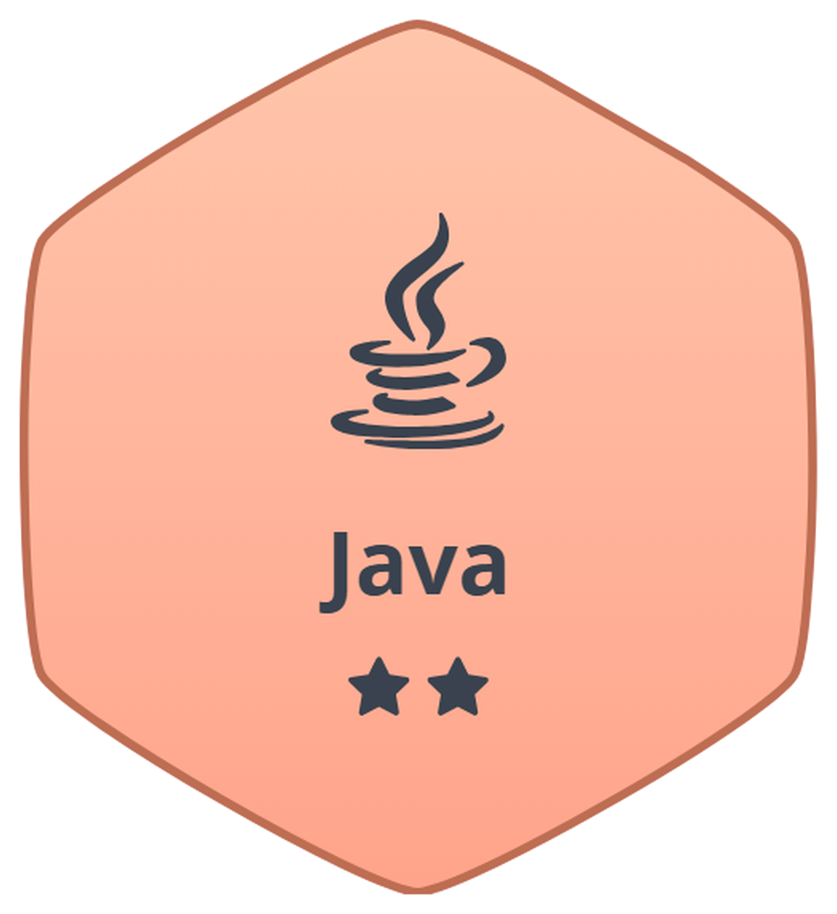

<div align="center">


</div>

# HackerRank Java Solutions

<div align="center">

### Java Programming & DSA Practice

A structured collection of my **Java solutions to HackerRank programming challenges**, focused on strengthening problem-solving, algorithmic thinking, and foundational Data Structures and Algorithms skills.



### 🏅 HackerRank Java Badge: 2 Stars

**What this means:** HackerRank awards stars for its Java skill track based on points earned by solving Java challenges. I have earned **2 stars** so far, and I'm continuing towards the next one.

[](https://www.hackerrank.com/profile/YOUR_USERNAME)


</div>

---

## About This Repository

This repository contains my solutions to programming challenges from **HackerRank**, written in Java.

I am using HackerRank to practice Java programming, improve my problem-solving abilities, and build a strong foundation in **Data Structures and Algorithms**.

Each challenge is organized in its own folder to keep the repository structured, readable, and easy to navigate.

This repository represents my **ongoing learning and practice**, with new solutions being added as I progress.

---

## Progress

| Track | Badge Earned | How It's Earned |
|-------|--------------|-----------------|
| Java | 2 Stars | Points from solving Java challenges on HackerRank |

🔗 [View my HackerRank profile](https://www.hackerrank.com/profile/YOUR_USERNAME)

---

## Topics Covered

The repository will gradually cover:

- Java Fundamentals
- Input and Output
- Conditional Statements
- Loops
- Strings
- Arrays
- Object-Oriented Programming
- Exception Handling
- Data Structures
- Sorting
- Searching
- Algorithms
- Dynamic Programming
- Problem-Solving Techniques

---

## Repository Structure

Each HackerRank challenge is organized in a separate folder.

```text
HackerRank-Java-Solutions/
│
├── README.md
├── .gitignore
│
├── 01-java-hello-world/
│   └── Solution.java
│
├── 02-java-if-else/
│   └── Solution.java
│
├── 03-java-output-formatting/
│   └── Solution.java
│
└── ...
```
